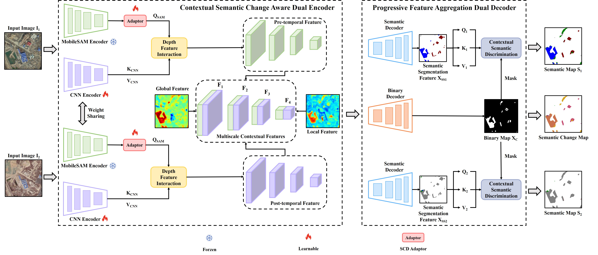
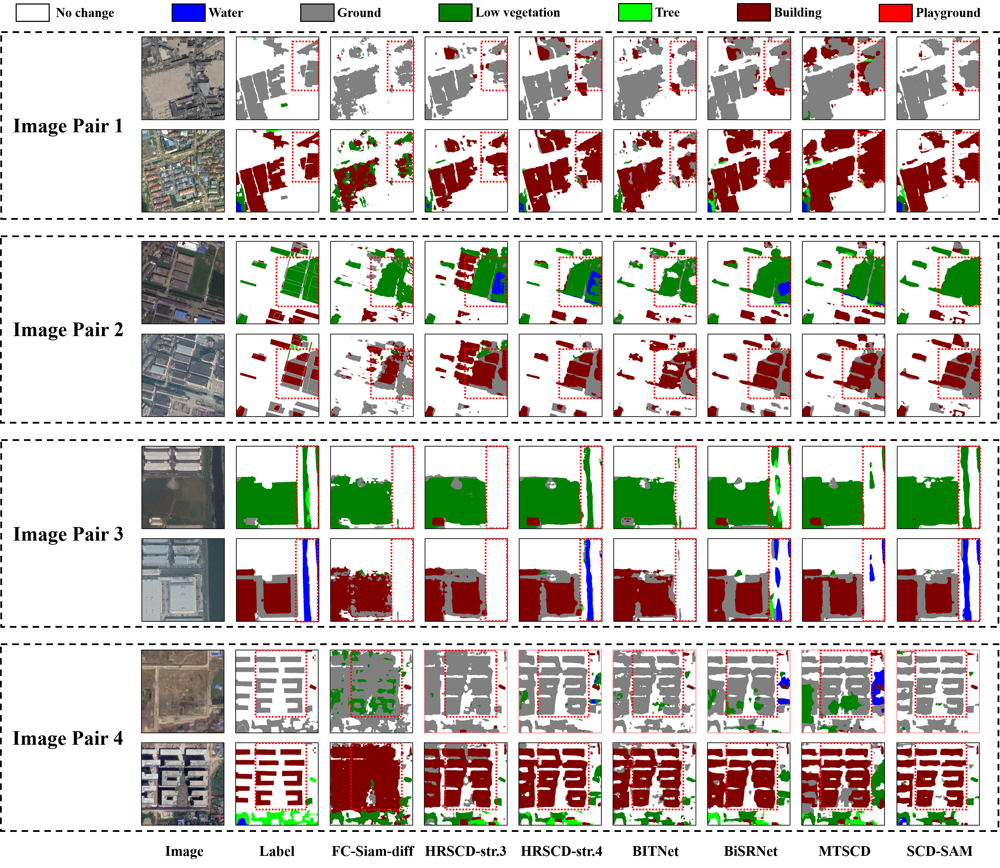
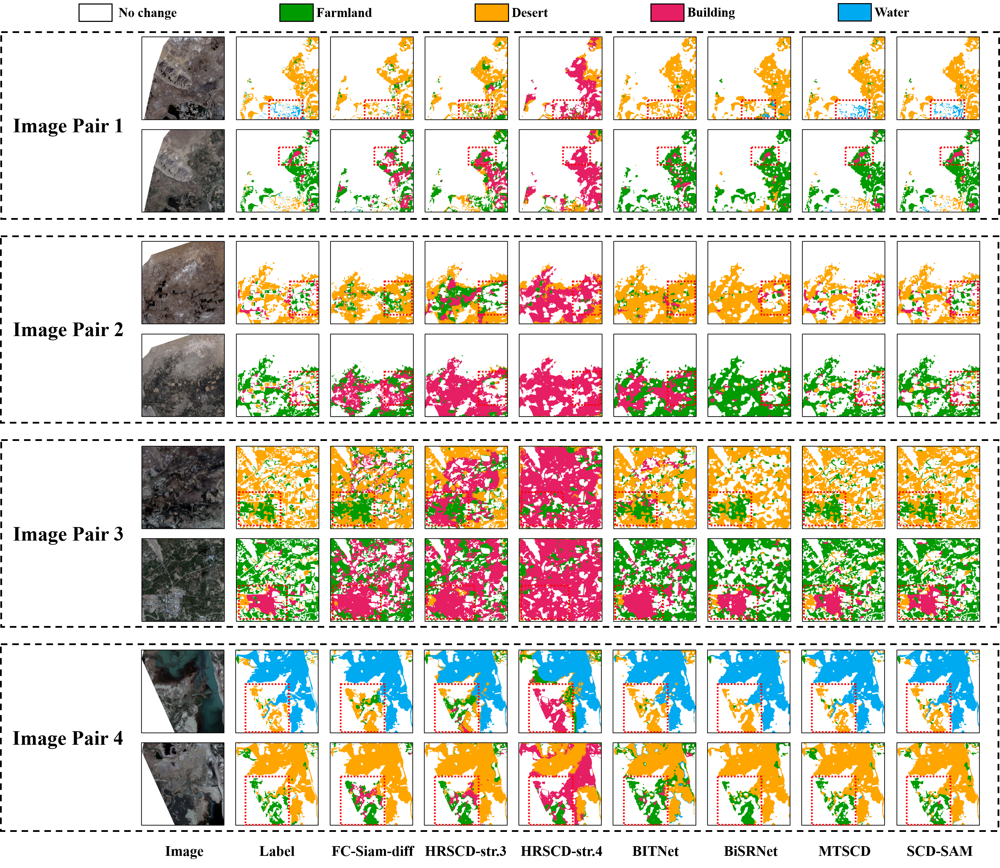

# SCD-SAM: Adapting Segment Anything Model for Semantic Change Detection in Remote Sensing Imagery
⭐ This code has been completely released ⭐ 

## Overview

<p align="center"> 
     
</p>


## Requirements

```python
Python 3.6
Pytorch 1.7.0
```


## Datasets Preparation

- The download link for the datasets is [here](https://pan.baidu.com/s/1vaLegDjMUvQjaNA4qNsBzw?pwd=fqsu). Put the datasets as follows:
```python
SCD-SAM
├── datasets
    ├── SECOND
    │   ├── train
    │   │   ├── im1
    │   │   │   ├── 00003.png
    │   │   │   ├── 00013.png
    │   │   │   ├── .....
    │   │   ├── im2
    │   │   │   ├── 00003.png
    │   │   │   ├── 00013.png
    │   │   │   ├── .....
    │   │   ├── label1
    │   │   │   ├── 00003.png
    │   │   │   ├── 00013.png
    │   │   │   ├── .....
    │   │   ├── label2
    │   │   │   ├── 00003.png
    │   │   │   ├── 00013.png
    │   │   │   ├── .....
    │   ├── val
    │   │   ├── im1
    │   │   │   ├── 00003.png
    │   │   │   ├── 00013.png
    │   │   │   ├── .....
    │   │   ├── im2
    │   │   │   ├── 00003.png
    │   │   │   ├── 00013.png
    │   │   │   ├── .....
    │   │   ├── label1
    │   │   │   ├── 00003.png
    │   │   │   ├── 00013.png
    │   │   │   ├── .....
    │   │   ├── label2
    │   │   │   ├── 00003.png
    │   │   │   ├── 00013.png
    │   │   │   ├── .....
```

## Train

Download `mobile_sam.pt` from [here](https://pan.baidu.com/s/1Kc-jPgr4YiH_eB5ZEKg3GQ) (snvf) and put it into `./weights`, then run:

```python
python train.py
```

## Test

The weights are available at [here](https://pan.baidu.com/s/1Kc-jPgr4YiH_eB5ZEKg3GQ) (snvf). Modify the paths in the eval.py, then simply run:

```python
python eval.py
```

## Visualization

Modify the paths in the visualization.py, then simply run:

```
python visualization.py
```

## Visual Results

<p align="center"> 
     
</p>


<p align="center"> 
     
</p>

## Citation

If you find the code helpful in your research or work, please cite the following paper:

```
@article{mei2024scd,
  title={SCD-SAM: Adapting segment anything model for semantic change detection in remote sensing imagery},
  author={Mei, Liye and Ye, Zhaoyi and Xu, Chuan and Wang, Hongzhu and Wang, Ying and Lei, Cheng and Yang, Wei and Li, Yansheng},
  journal={IEEE Transactions on Geoscience and Remote Sensing},
  year={2024},
  volume={62},
  pages={1--13},
  publisher={IEEE}
}
```

